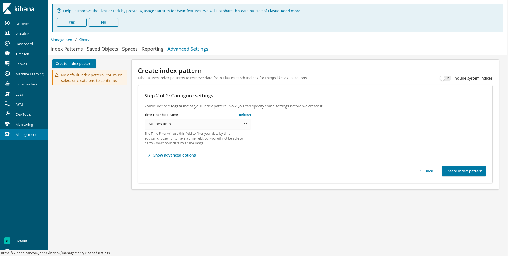
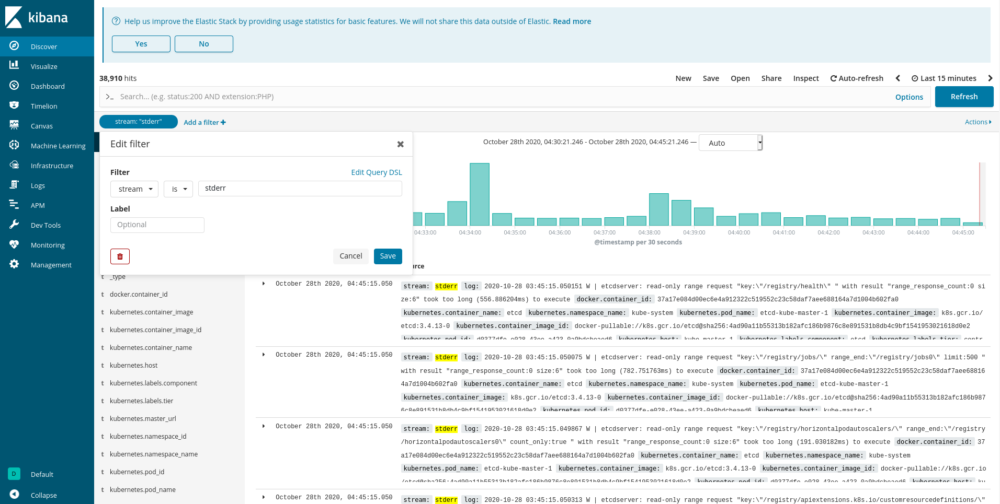
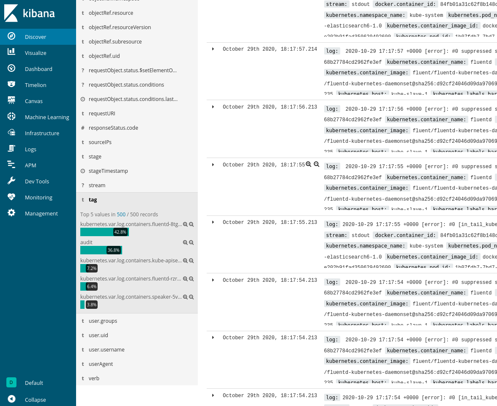
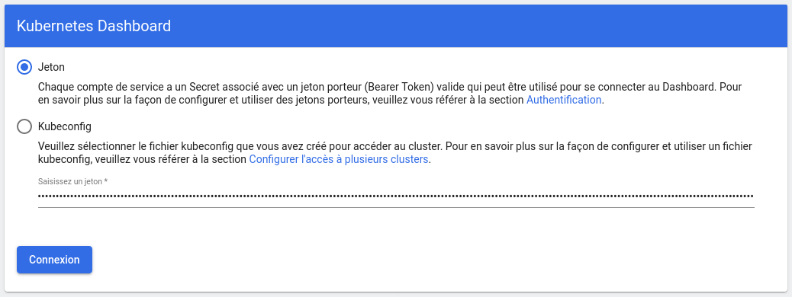
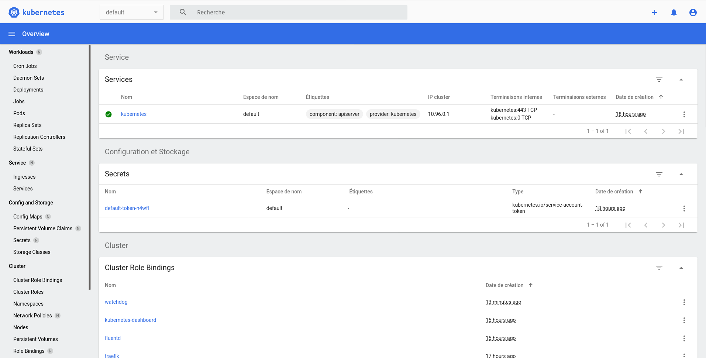

Well, things are getting real and are on the point to become quite complex. So we'll setup (super unsafe) dashboards to see what is going on easily. After all, we have nothing critical for now, but we might get troubles soon. And, don't worry, we'll make it safe just after that.

## 1. Traefik dashboard: monitoring routes

The traefik dashboard will help us in the diagnostics of our ingress routes and traefik-related stuff. For this, we need to:
* update our ingress controller previously deployed to enable the dashboard
* and create routes to the dashboard.

Use the [:clipboard: kubernetes/traefik/21-IngressController.yaml](./kubernetes/traefik/21-IngressController.yaml) and [:clipboard: kubernetes/traefik/23-IngressRoutes.yaml](./kubernetes/traefik/23-IngressRoutes.yaml) templates.




```sh
kubectl apply -f ./kubernetes/traefik/21-IngressController.yaml
kubectl apply -f ./kubernetes/traefik/23-IngressRoutes.yaml
```

Now, you should be able to reach the dashboard via [https://traefik.{{cluster.baseHostName}}/dashboard/]().

## 2. Kibana: harvest data from your cluster


* <https://kubernetes.io/docs/tasks/debug-application-cluster/logging-elasticsearch-kibana/>
* <https://mherman.org/blog/logging-in-kubernetes-with-elasticsearch-Kibana-fluentd/#fluentd>
* <https://www.elastic.co/kibana>
* <https://www.elastic.co/elasticsearch/>


[*Kibana*](https://www.elastic.co/kibana) is a super versatile tool to visualize data stored in *Elasticsearch*.

[*Elasticsearch*](https://www.elastic.co/elasticsearch/) is a database particularly adapted for search engines, with [fulltext search](<!-- TODO -->) and [scoring](<!-- TODO -->) capabilities.

Together, they compose the perfect combo to ingest all our cluster's logs, and do searches, visualizations, tracking, and everything you'll need to understand what is going on in your cluster's apps.


Elasticsearch may be quite resources-consuming, and your machines may not be optimized to make it run smoothly with the consequent flow of data its about to ingest. I **strongly** advise you to read some [installation documentations](https://www.elastic.co/guide/en/elasticsearch/reference/master/docker.html#docker-prod-prerequisites) to make things correctly.

Reading a guide don't dispense you from RTFMing.


### 2.1. Pods logs

We'll start by getting our pods (container) logs. Deploy the following configuration files:








```sh
kubectl apply -f ./kubernetes/kibana/01-Namespace.yaml
kubectl apply -f ./kubernetes/kibana/11-Elasticsearch.yaml
kubectl apply -f ./kubernetes/kibana/12-Kibana.yaml
kubectl apply -f ./kubernetes/kibana/13-Fluentd.yaml
kubectl apply -f ./kubernetes/kibana/21-Ingress.yaml
```

Once applied, you should be able to reach your kibana dashboard via <https://kibana.{{cluster.baseHostName}}/>. Be patient, it may take a bit of time to initialize ElasticSearch and Kibana itself. Once they started up, let's configure those !

Go to the *Discover* page. Kibana should ask to create indices. Index logs with pattern `logstash*`.


Then, set up the time field as `@timestamp`.



Finally, go back to the *Discover* page. You should get at least your pods logs!



I strongly recommend you to inspect logs carefully, to clean up as many errors as possible. Yeah, you should have done that all the way long, but looking everywhere is painful, I know. So **do that now** while you don't have a bunch of things to pollute your streams.

### 2.2. Audit logs

For a reason I can't explain, the default settings for audit log parsing from fluentd are incorrect. Moreover, I find the "all settings in a single file" pattern awful. So we are going to reconfigure fluentd to parse correctly our logs. Use the [:clipboard: kubernetes/kibana/31-Fluentd.yaml](./kubernetes/kibana/31-Fluentd.yaml) & [:clipboard: kubernetes/kibana/32-FluentdConfigMap.yaml](./kubernetes/kibana/32-FluentdConfigMap.yaml) templates. The 1st one revrite some of the configuration of fluentd to use our custom configs.




```sh
kubectl apply -f ./kubernetes/kibana/31-Fluentd.yaml
kubectl apply -f ./kubernetes/kibana/32-FluentdConfigMap.yaml
```

You should now be able to filter your logs by tag, and look at the audit logs.



So, in this setup, your audit logs are at 2 places: directly bare on your server, and in kibana. This redundancy is important IMO because whatever happens to your cluster (even a full flush of all your pods), you should be able to know who did what.

### 2.3. Make things persistent

<!-- TODO -->
Now that you have set up everything, you might have seen that everytime the ElasticSearch pod is restarted, the database is emptied. This is normal so far, because we don't actually write any data on a persistent storage. For now ! But let's solve that.

## 3. Kube dashboard: Web UI to administrate the cluster


* <https://kubernetes.io/fr/docs/tasks/access-application-cluster/web-ui-dashboard/>





```sh
kubectl apply -f ./kubernetes/kube-dashboard/01-Dashboard.yaml
kubectl apply -f ./kubernetes/kube-dashboard/02-IngressRoutes.yaml
```

Then, for debugging purpose, we'll set up a test service account that can only view and list items in the dashboard. This service account will be named `watchdog`.



```sh
# Create the role, cluster role and service account using them
kubectl apply -f ./kubernetes/kube-dashboard/03-ServiceAccount.yaml
# Get the secret's name
secret_name="$(kubectl get serviceaccount watchdog -n kubernetes-dashboard -o json | jq '.secrets[0].name' -r)"
# Get the secret's token
echo $(kubectl get secret $secret_name -n kubernetes-dashboard -o json | jq '.data.token' -r  | base64 --decode)
```

Now, navigate to `https://kube-dashboard.{{cluster.baseHostName}}` and log in using the token you got above.



You should be able to see all resources in your cluster.



Yes, this is super unsafe. That's why we are going to add authentication right now, and why I told you not to make this publicly exposed for now.


