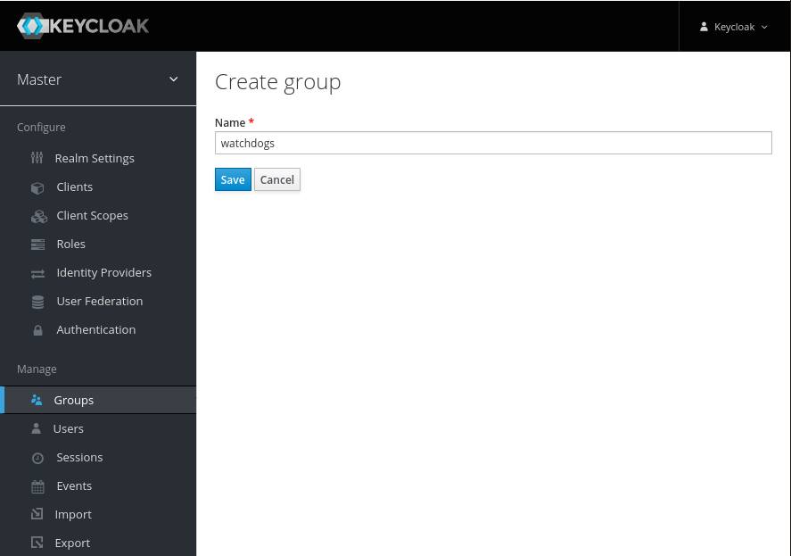
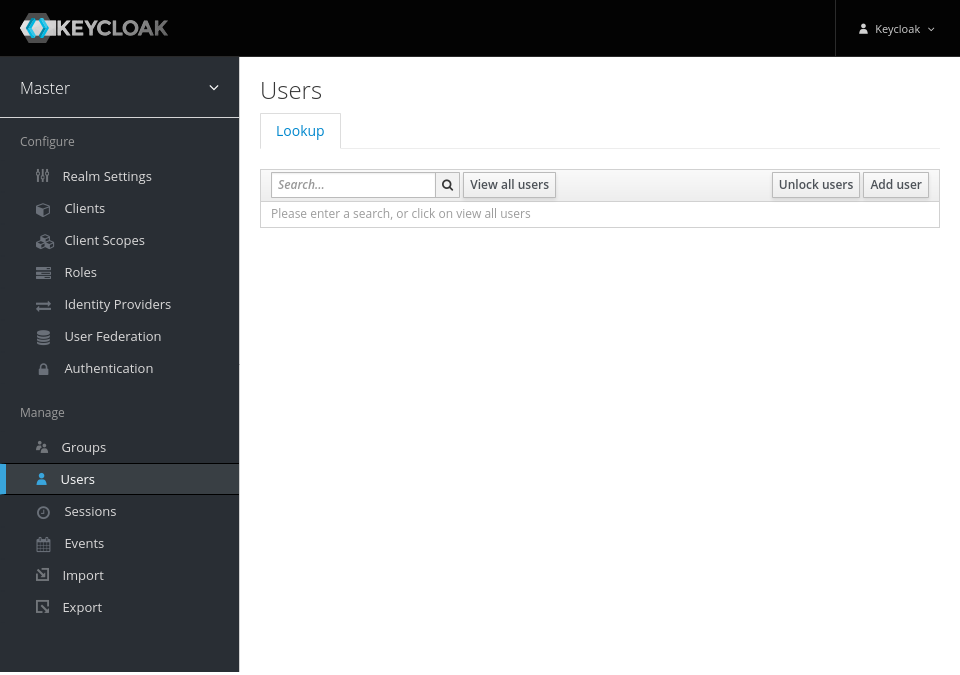
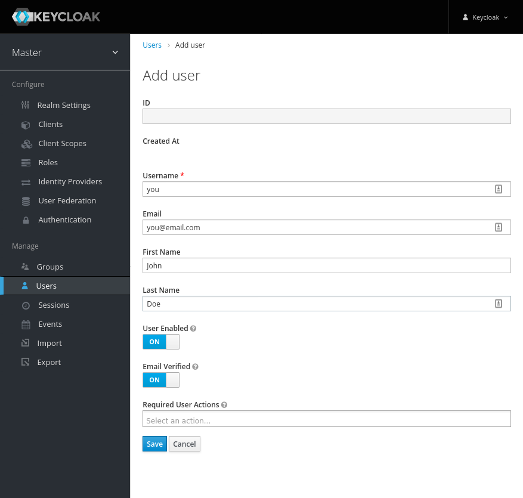
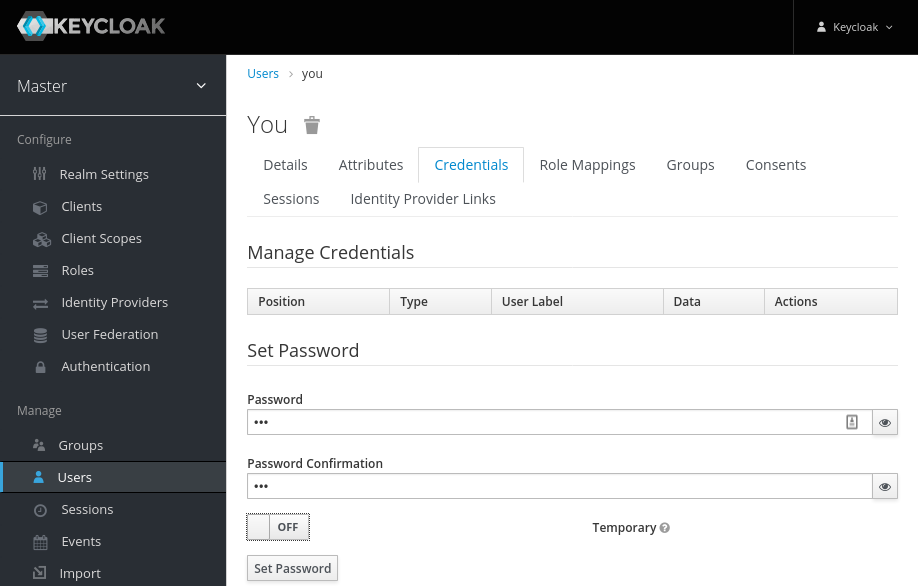
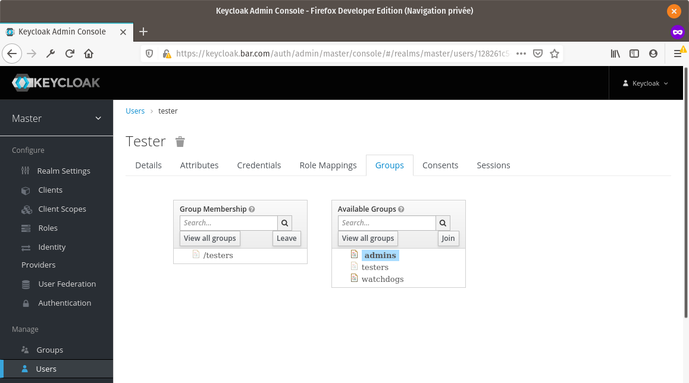

Here is a graph of the RBAC setup we are going to implement:


## 1. Setup keycloak

We'll use keycloak to proxy our authentication for all monitors, using a single realm. You may use several realms in real-life situations. This is probably the tough part, and you may tweak heavily the following guide. Moreover, I may forgot to write some instructions, or somes are heavily linked to your very own setup.

### 1.1. Install keycloak


* <https://kubernetes.github.io/ingress-nginx/examples/auth/oauth-external-auth/>
* <https://itnext.io/protect-kubernetes-dashboard-with-openid-connect-104b9e75e39c>
* <https://geek-cookbook.funkypenguin.co.nz/ha-docker-swarm/traefik-forward-auth/keycloak/>
* <https://medium.com/docker-hacks/how-to-apply-authentication-to-any-web-service-in-15-minutes-using-keycloak-and-keycloak-proxy-e4dd88bc1cd5>



<https://www.openshift.com/blog/adding-authentication-to-your-kubernetes-web-applications-with-keycloak>

Start by installing *Keycloak* via the [:books: *Helm* chart](https://hub.helm.sh/charts/codecentric/keycloak) & expose it, using following templates: 
* [:clipboard: authentication/01-KeycloakChartValues.yaml](./kubernetes/authentication/01-KeycloakChartValues.yaml)
* [:clipboard: authentication/02-PublicRoute.yaml](./kubernetes/authentication/02-PublicRoute.yaml)




Note that the template [`authentication/01-KeycloakChartValues.yaml`](./kubernetes/authentication/01-KeycloakChartValues.yaml) contains the bare minimum settings for the keycloak chart with your route. You **should** tweak them to match your setup & security requirements. [:books: RTFM the chart](https://hub.helm.sh/charts/codecentric/keycloak)

```sh
# Add the keycloak chart repository
helm repo add codecentric https://codecentric.github.io/helm-charts
# Create the keycloak's dedicated namespace
kubectl create namespace keycloak
# Install keycloak in its dedicated namespace
helm install keycloak -f ./kubernetes/authentication/01-KeycloakChartValues.yaml codecentric/keycloak --version 9.5.0 --namespace keycloak
# Initialize traefik routing to it.
kubectl apply -f ./kubernetes/authentication/02-PublicRoute.yaml
```

> You can remove this chart by running `helm uninstall keycloak -n keycloak`, or by deleting namespace `keycloak` altogether.

This install should end by displaying either the default keycloak user's password, or the command to get it.

### 1.2. Alias hostname of keycloak from the cluster


* https://stackoverflow.com/a/54692872


> **Note :** This part is not required if you use a real host name registered with a A record. But if you use a fake hostname (which I still recommend at that point), DNS resolution of services trying to reach keycloak will fail, because your pods don't know where is `https://keycloak.{{cluster.baseHostName}}`.

We are going to alias the hostname `keycloak.{{cluster.baseHostName}}` so that it resolves to the internal name of our keycloak service, `keycloak-http.keycloak.svc.cluster.local`. For this, you need to edit *CoreDNS* configuration.

```sh
# Open the CoreDNS config map
kubectl edit configmap coredns -n kube-system
```

Add the following into your `Corefile` section:

```
rewrite name keycloak.{{cluster.baseHostName}} keycloak-http.keycloak.svc.cluster.local
```

> I added it just above the `ready` block (I don't know if it really matters).

Then, restart *CoreDNS* pods by deleting them.

```sh
kubectl -n kube-system delete pods $(kubectl -n kube-system get pods -l k8s-app=kube-dns -o json | jq '.items[].metadata.name' -r)
```

This may take some time and crash kubectl connection to the API server. Don't worry, it will reschedule our pods and restart everything after some time.

So, now, we can use `keycloak.{{cluster.baseHostName}}` as a domain name everywhere we want, and it will resolve to the cluster's internal IP of keycloak's service.

### 1.3. Open keycloak admin panel

Log in to your keycloak admin dashboard by reaching `https://keycloak.{{cluster.baseHostName}}/auth/admin/`.

* Username: `keycloak`
* Password: The one displayed at the end of the keycloak install, or get it with `kubectl get secret --namespace default keycloak-http -o jsonpath="{.data.password}" | base64 --decode; echo`

### 1.4. Configure keycloak

#### 1.4.1. Create groups

To manage our groups, go to *`Master` realm* > *`Manage`* > *`Groups` section* > *`New` button*.



Create all the groups you need. For the setup I describe, I have to create groups `watchdogs` and `admins`.

#### 1.4.2. Create users

To manage our users, go to *`Master` realm* > *`Manage`* > *`Users` section* > *`Add user` button*. Fill the form with at least a username. I usually **check** *email verified* just in case because I trust the emails I put in.





If you want to allow this user to log in via username/password, set its password in the *`Credentials` tab*. If the `Temporary` option is set, the user will have to change its password on first login.



Assign your new user to the groups you want by going to the *`Groups` tab*.



Go on and create all the users you need, and assign relevant groups to them.

#### 1.4.3. Setup clients & scopes

> :information_source: Info: If you're not familiar with oauth2, *clients* are *roughly* applications that are allowed to authenticate users in your authentication system (keycloak). *Clients* can ask for grants of *scopes*, that are user informations they want to access to.

Back in the dashboards setup, we'll protect our apps `Test app`, `kibana`, `kube dashboard` & `traefik` using [`quay.io/keycloak/keycloak-gatekeeper`](https://quay.io/repository/keycloak/keycloak-gatekeeper).

##### 1.4.3.1. Create scopes

Since our apps `Test app`, `kibana`, `kube dashboard` & `traefik` will all rely on the same information (`group`), we can get our setup easier by adding a shared `Client scope`. Go to *`Master` realm* > *`Configure`* > *`Client Scopes` section*. Here, check if there is a client scope named `group` (I didn't, but just in case).

If not, create one named `group`, then save it. If there is one, check if the following config matches or create a new one.

After, go to the new *`Mappers` tab* & create a new mapper. This mapper will put the groups we set up earlier in our user's token. Set its `Mapper Type` to `Group Membership`, & the `Token Claim Name` to `groups`. This is the name of the token's field we'll use later in our authentication proxy.


Once done, you **may** add it to the default *client scopes*.  Go to *`Master` realm* > *`Configure`* > *`Client Scopes` section* > *`Default Client Scopes` tab*, & add our `group` to the assigned column. You should probably not set it as `Optional`.

##### 1.4.3.2. Create client

We are going to create our authentication for the app `nginx-test` (with url `https://test.{{cluster.baseHostName}}`). Fill the `Client ID` with :bookmark: `{{nginxTest.clientId}}` (for instance, `nginx-test`).

Since this application will be logged in through a proxy (we'll get back to that part next in the dashboard setups), set its `Access Type` to `confidential`.

Set the valid redirect URIs to `https://test.{{cluster.baseHostName}}/oauth/callback` (the `/oauth/callback` part is required by the gatekeeper).

Then, we need to add an audience. This field is required by gatekeeper to check our key. Go to the *`Mappers` tab*, & create a new mapper. Name it, for instance, `audience`, of `Mapper Type` `Audience`, & set the `Included Client Audience` to our :bookmark: `{{nginxTest.clientId}}`. Save it.

After this, check our *client scopes* by going to the *`Client Scopes` tab*. In the *`Setup` sub-tab*, make sure that our `groups` *client scope* is **assigned**. Then, you can test our setup ! Go to the *`Evaluate` sub-tab*, pick the `User` you want to check, click `Evaluate` then go to *`Generated Access Token` sub-sub-tab*. It should contain a key `groups` with all our user's groups, prefixed with a `/`, and a key `aud` with at least our :bookmark: `{{nginxTest.clientId}}`. If its okay, we are good to go !

And, finally, go to the *`Credentials` tab* & get the secret. It will be used as :bookmark: `{{nginxTest.clientSecret}}`.

Other clients protected by keycloak-gatekeeper will be very similar.

## 2. Setup our test application protected by authentication


* https://www.openshift.com/blog/adding-authentication-to-your-kubernetes-web-applications-with-keycloak


We'll start with the simplest of our cases: the `nginx-test` app. This will allow us to get used to keycloak for our authorization mechanism. We'll proxy a simple nginx default instance behind our authentication proxy.

> :information_source: Info: At the time of writing this, [`quay.io/louketo/louketo-proxy`](https://quay.io/repository/louketo/louketo-proxy?tag=latest&tab=tags) is in an [End Of Life state](https://github.com/louketo/louketo-proxy/issues/683), but someone [seems up to take it back](https://github.com/louketo/louketo-proxy/issues/683#issuecomment-709682039). Let's cross fingers he does a great job !

Look at the [:clipboard: 11-TestNginx.yaml](./kubernetes/11-NginxTest.yaml) template.

As you may notice in this template, the option `--discovery-url=https://keycloak.{{cluster.baseHostName}}/auth/realms/master` tells our authentication proxy where is our OAuth2 provider. If you are using an aliased hostname, this won't resolve, as your server can't resolve an IP for this hostname. That's why we edited *CoreDNS* configuration earlier.

So let's deploy that:

```sh
kubectl apply -f 11-NginxTest.yaml
```

> Gen random 32 chars str: `$(cat /dev/urandom | tr -dc 'a-zA-Z0-9' | fold -w 32 | head -n 1)`

Now, you should be able to access `https://test.{{cluster.baseHostName}}/`, that will redirect you to `https://keycloak.{{cluster.baseHostName}}/...` for authentication. Once logged in, you'll be redirected to `https://test.{{cluster.baseHostName}}/oauth/callback?...` that will log you in the proxy, check your infos, & allow you to pass through if you matches the criterions.

To log out from our authentication proxy, simply reach `https://test.{{cluster.baseHostName}}/oauth/logout`. You may need to refresh the page without cache on the base url again ( `/` ) in order to re-request to log in, otherwise the nginx page you'll see would be cached.

Well, now we know that our stuff work ! Let's delete this test application.

```sh
kubectl delete -f 11-NginxTest.yaml
```

## 3. Persist data from *Keycloak*


* [chown: changing ownership of ‘/var/lib/postgresql/data’: Operation not permitted, when running in kubernetes with mounted "/var/lib/postgres/data" volume #361](https://github.com/docker-library/postgres/issues/361)


You can use a persistent datastore by uncommenting a section in the provided template. But for this, you'll need a persistent volume.

```sh
kubectl apply -f authentication/21-PersistentVolumeClaim.yaml
helm update keycloak -f authentication/22-KeycloakChartValues.yaml codecentric/keycloak --version  9.5.0 --namespace keycloak
```

Initialization of PostgreSQL may take some time. Don't hesitate to look at the logs of both of PostgreSQL and Keycloak.

Once done, you will need to redo all the steps above, because you're now using a brand new real database.


